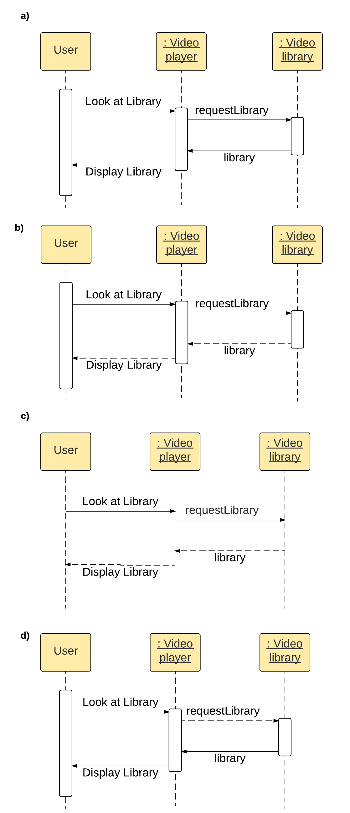

Q: Which of these terms are used to describe coupling? Choose the 3 correct answers.
A: flexibility/degree/ease
---
Q: Which is the most desirable?
A: high cohesion, loose coupling
---
Q: What are some keywords you might use for information hiding in Java? Select the three correct answers.
A: private/[none]/protected
---
Q: What are the best ways to promote Conceptual Integrity in your software? Choose the two correct answers.
A: Planning the architecture of the system/Regular code reviews
---
Q: Information Hiding is closely related to one of the core design principles of object-oriented design. Which one?
A: encapsulation
---
Q: Which of these sequence diagrams is correct?
A: b)

---
Q: What are elements of a state in a State diagram?
A: state variables/activities/state name
---
Q: When is Model Checking conducted?
A: After development
---
Q: What are the phases of Model Checking? Choose the 3 correct answers.
A: Analysis Phase/Modeling Phase/Running Phase
---
Q: During model checking, what is the name for a violation of the desired properties of the model?
A: Counterexample
---
Q: When two processes cannot run because they are waiting on the same resource, it's called…
A: Deadlock
---
Q: Choose the three examples of inheritance used poorly:
A: Inheritance is used to share behaviour without specializing/A method in the superclass is overwritten with different behaviour by a subclass./A subclass inherits methods from the superclass and adds extra, new, unrelated functionality