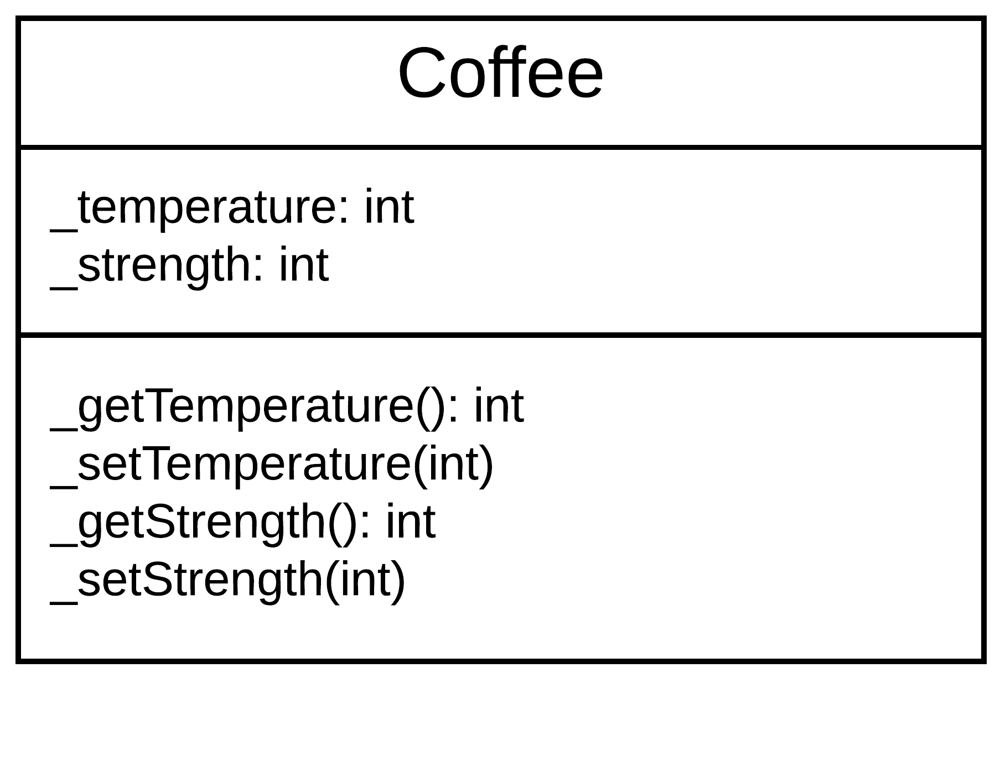
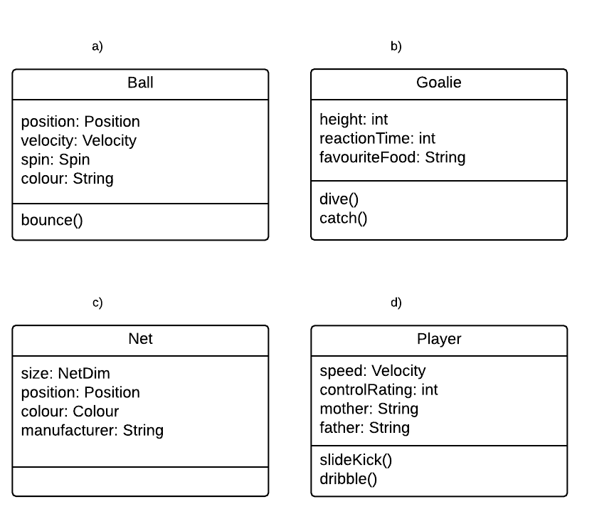
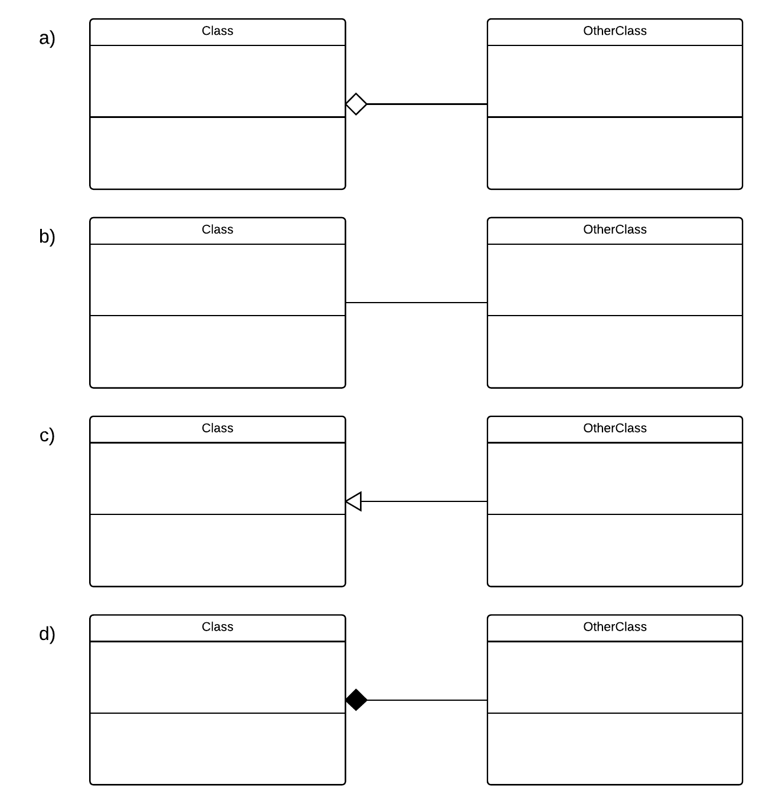
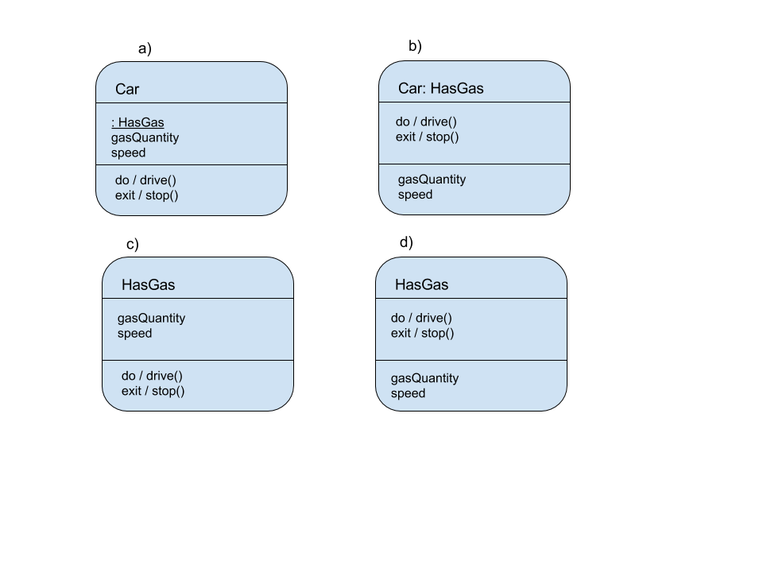

Q: The first stage of the two-stage design process is  _______ design.
A: conceptual
---
Q: The second stage of the two-stage design process is ________ design.
A: technical
---
Q: Which of these conceptual design techniques will help you analyze the problem space to determine classes for your object-oriented software? Choose the two correct answers.
A: mockups/CRC
---
Q: During conceptual design, once the problem is mapped into components, what are the other two critical pieces of information that you must specify for these classes or components? Choose the two correct answers.
A: collaborators/responsibilities
---
Q: You are writing the CRC card for a Bear component. Choose the two responsibilities.
A: eat berries/hunger
---
Q: You are writing the CRC card for a Bear component. Choose the three collaborators.
A: bear/tree/den
---
Q: You create an object that represents a user, storing important information about them such as their preferences. What kind of object is this?
A: entity
---
Q: You create an object that represents a dialog box. It creates buttons and text fields, etc, for the user to interact with, and it logs those interactions. What kind of object is this?
A: boundary
---
Q: You create an object that compares values from two different sources. It then updates the smaller value to be equal to the larger one. What kind of object is this?
A: control
---
Q: Which of these is an example of a quality tradeoff?
A: Adding security knowing it will reduce speed
---
Q: What is the term for reducing a class or object to its inputs and outputs in modelling?
A: black box thinking
---
Q: Which one of these classes is in most need of being decomposed?
A: Store
---
Q: Question 13
In order to provide good encapsulation, fill-in-the-blanks on this UML class diagram: (Replace the underscores _ from top to bottom with minus signs ("-") or plus signs ("+"); your answer will be a string of six + or - signs with no spaces)
A: --++++

---
Q: You are writing a simple soccer video game. Select the best example of proper abstraction:
A: a

---
Q: Which design principle enables developers to follow the guideline D.R.Y. ("Don't Repeat Yourself"):
A: generalization
---
Q: Which of these UML class diagrams shows an association relationship?
A: b

---
Q: Which of these UML class diagrams depicts an aggregation ("has-a") relationship between the two classes?
A: a

---
Q: Which of these UML class diagrams depicts a composition, or a strong "has-a" relationship?
A: d

---
Q: Select the object pairing that has an association relationship:
A: Hiker - Trail
---
Q: Select the object pairing that has an aggregation relationship:
A: Stapler - Staple
---
Q: Select the object pairing that has a composition relationship:
A: Book - Page
---
Q: Choose the two answers that correctly complete the following sentence:
A: ...it tries to encapsulate too many unrelated responsibilities./...its purpose is unclear.
---
Q: Two classes are tightly coupled. What are some ways you might be able to tell? Choose the two correct answers.
A: In order to understand one class, you need to open up the other to look at the implementation/They are very highly reliant on each other
---
Q: How can you apply the principle of Separation of Concerns in object-oriented programming?
A: Separate objects or components according to their role in the software
---
Q: Which of these violates Liskov's Substitution Principle?
A: an operation in the superclass is replaced by a different operation in the subclass
---
Q: For which of these situations would you use a sequence diagram?
A: To show the collaborative behaviour of objects in your program.
---
Q: Choose the correct state diagram for a car which has a state called "HasGas:"
A: c

---
Q: Which of these elements represents a termination in a UML State diagram?
A: a

---
Q: What is the purpose of model checking?
A: To check the software for errors before release
---
Q: What is an abstract data type?
A: a type of data defined by the developer rather than the language. 